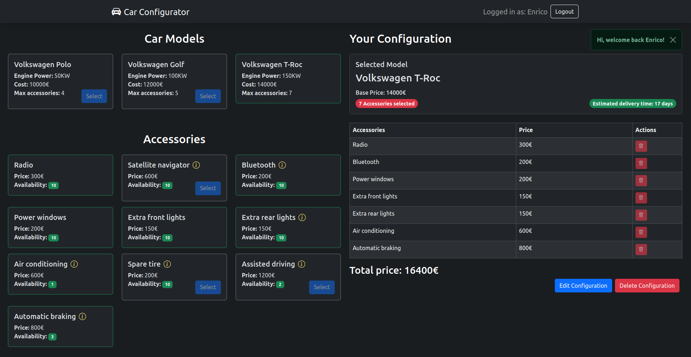

# Car Configurator

## React Client Application Routes

- Route `/`: Home page, shows the full list of car models and accessories.
- Route `/login`: Login form, allows users to login. 
- Route `/user/configuration`: Page showing the user car configuration. The logged-in user can edit (if already present) or create a car configuration.
- Route `*`: Page for nonexisting URLs (_Not Found_ page) that redirects to the home page.

## API Server

### Sessions
- POST `/api/sessions`
  - Authenticate a user based on email and password.
  - Request: LOGIN_OBJ
  - Response: `200` (requested USER_OBJ), `401` (Unauthorized)
- GET `/api/sessions/current`
  - Checks if the user is currently authenticated.
  - Request: must include credentials
  - Response: `200` (current USER_OBJ), `401` (Not authenticated)
- DELETE `/api/sessions/current`
  - Logs out the current user.
  - Request: empty
  - Response: `200` (successful logout, empty `{}`), 

```json lines
--- USER_OBJ ---
{
  "id": 1,
  "email": "user1@gmail.com",
  "name": "Enrico",
  "isGoodClient": 1,
  "hasCarConfiguration": 0
}

--- LOGIN_OBJ ---
{
  "username": "user1@gmail.com",
  "password": "exam"
} 
```

### Car models and accessories
- GET `/api/carModels`
    - Retrieves the list of available car models.
    - Request: empty
    - Response: `200` (list of MODEL_OBJ), `500` (Internal Server Error)
- GET `/api/accessories`
    - Retrieves the list of available car accessories.
    - Request: empty
    - Response: `200` (list of ACCESSORY_OBJ), `500` (Internal Server Error)

```json lines
--- MODEL_OBJ ---
{
  "id": 1,
  "model": "Volkswagen Polo",
  "enginePower": 50,
  "cost": 10000,
  "maxAccessories": 4
}

--- ACCESSORY_OBJ ---
{
  "id": 1,
  "name": "Radio",
  "price": 300,
  "availability": 11,
  "requiredAccessoryId": null,
  "incompatibleAccessoryId": null
}
```

### User Car Configuration (must be authenticated)

- GET `/api/user/configuration`
    - Retrieves a user car configuration.
    - Request: empty, must include credentials
    - Response: `200` (requested CONF_OBJ), `401` (Unauthorized), `404` (Not found), `500` (Internal Server Error)
- POST `/api/user/configuration`
    - Saves a new car configuration for a user.
    - Request: NEWCONF_OBJ, must include credentials
    - Response: `200` (OK, status message), `401` (Unauthorized), `422` (Unprocessable content), `503` (Service Unavailable).
- PUT `/api/user/configuration/edit`
    - Updates an existing car configuration for a user.
    - Request: NEWCONF_OBJ, must include credentials 
    - Response: `200` (OK, status message), `401` (Unauthorized), `422` (Unprocessable content), `503` (Service Unavailable).
- DELETE `/api/user/configuration`
    - Deletes the car configuration for a user.
    - Request: empty, must include credentials
    - Response: `200` (OK), `503` (Service Unavailable)
```json lines
--- CONF_OBJ ---
{
  "carModelId": 1,
  "accessoryIds": [1,3,5]
}

--- NEWCONF_OBJ ---
{
  "carModelId": 2,
  "accessories": [1,2,3]
}
```

### Token
- GET `/api/auth-token`
    - Returns an authentication token for the logged-in user.
    - Request: empty, must include credentials
    - Response: `200` (OK), `401` (Unauthorized)

```json lines
--- TOKEN PAYLOAD ---

{ "isGoodClient": true, "userId": 1 }
```
## API Server2

- GET `/api/estimate`
  - Returns the car delivery estimation time given the accessories selected by the user.
  - Request Headers: JWT token with the isGoodClient flag
  - Request body: REQ_OBJ containing a list of accessory names.
  - Response: RES_OBJ with the days estimated, `200` (OK), `400` (Bad Request).

```json lines
--- REQ_OBJ ---
{ "accessories": ["bluetooth", "power windows", "air conditioning", "spare tire"] }

--- RES_OBJ ---
{ "days": 46 }
```
## Database Tables

- Table `users`: autogenerated_id, name, email, hash, salt, isGoodClient (boolean), hasCarConfiguration (boolean).
- Table `car_models`: autogenerated_id, model (name), enginePower (integer in [50,100,150]), cost, maxAccessories.
- Table `accessories`: autogenerated_id, name, price, availability.
- Table `accessory_constraints`: accessoryId, requiredAccessoryId (NULLable, references the required accessory id), incompatibleAccessoryId (NULLable, references the incompatible accessory id).
- Table `configuration`: autogenerated_id, userId (references the user id), carModelId (references the car model id).
- Table `configuration_accessories`: autogenerated_id, configurationId (references the configuration id), accessoryId (references the accessory id). 

## Main React Components

- `Main` (in `App.jsx`): technically a component, takes the role of App and is rendered inside a Router. 
All the main routes are defined here. Here there are the login/logout states along with the helper functions for authentication. 
Same applies to the auth-token. Moreover, the car model/accessories and the selection states are defined here and shared among 
the principal components. 
- `LoginForm` (in `Auth.jsx`): the login form that users can use to log-in into the app.
This is responsible for the client-side validation of the login credentials. 
- `CarConfigurator` (in `CarConfigurator.jsx`): the component that displays all the car models and accessories and allows
an (authenticated) user to select them according to the specified constraints. 
- `UserConfiguration` (in `UserConfiguration.jsx`): the component that is in charge of fetching the user configuration and 
eventually modify/create one. This component handles other constraints related to the edit and save of a configuration along 
with different helper function for validating some user actions. It's also in charge of fetching the estimated time for delivering
the car chosen by the user.
- `GenericLayout` and `UserConfigurationLayout` (in `Layout.jsx`): components in charge of loading the main components and 
sharing the states among them. 
- `DisplayMessage` (in `Message.jsx`): helper component for displaying the most important status messages in the application.

Minor components are `LoginLayout`, `NotFoundLayout`, `LoginButton`, `LogoutButton`.
## Screenshot



## Users Credentials

| Email           | Password | Name      | Status     |
|-----------------|----------|-----------|------------|
| user1@gmail.com | exam     | Enrico    | GoodClient |
| user2@gmail.com | exam     | Antonio   | /          |
| user3@gmail.com | exam     | Francesco | /          |
| user4@gmail.com | exam     | Giorgio   | /          |
| user5@gmail.com | exam     | Aurora    | GoodClient |

## Tutorial

1. Run this command in the main three folders (client, server, server2) to download all the required modules.
```
npm ci
```
2. Start the application with the following command in the client folder.
```
npm run dev
```